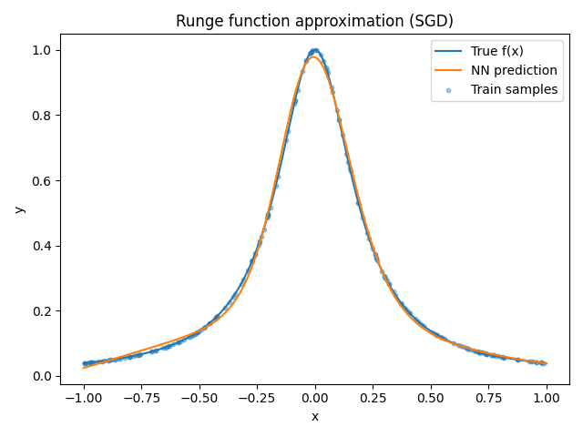
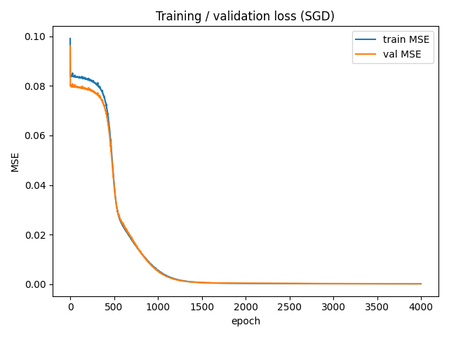
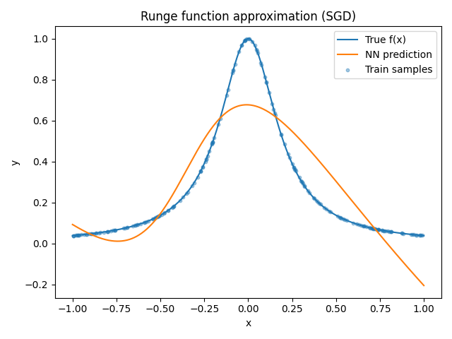

# 使用神經網路近似Runge函數
## Introduction
目標是利用feedforward neural network去近似Runge函數:

$$
f(x) = \frac{1}{1+25x^2}, \quad x\in[-1, 1].
$$

這個函數在 $x=0$ 處有peak，而在邊界處趨近於0。我們訓練一個NN學習此映射，並透過訓練/驗證誤差來評估模型表現。

## Method
**資料集**
- 在區間 $[-1,1]$ 上鈞源抽樣產生訓練與驗證資料
- 目標值由Runge函數計算而得。
- 額外建立1000個等據點用於plot與誤差評估

**模型**
- MLP，包含兩層hidden layer，activation function 是 tanh, 然後還有 linear output layer.
- 權重初始化：採用 Xavier 初始化，以確保訓練初期的穩定性。

**訓練**
- Optimizer:SGD，並搭配學習率調整策略
- Loss Function:MSE
- Regularization: 小部分的weight decay，避免overfitting(沒加之前自己跑測試集都爆噴 請GPT救我的)
- early stopping: 根據驗證誤差選擇最佳模型。

## Result
**函數近似**
下圖為真實的 Runge 函數（藍線）與神經網路預測（橘線）的比較： 
- 模型成功捕捉了中央的峰值與大致形狀。
- 在區間邊界仍有一定的偏差，與已知的 Runge 現象一致。

**損失曲線**
訓練與驗證的 MSE 隨著迭代逐漸下降：
- 訓練誤差持續降低至小值。
- 驗證誤差趨於穩定，顯示模型具有合理的泛化能力，沒有出現嚴重過擬合。

**誤差**
- MSE on dense grid: $1.378813 \times 10^{-4}$
- Max error (L_inf): $3.016340 \times 10^{-2}$
誤差結果顯示模型對函數有良好近似。

## Conclusion
- 近似的結果與網路的神經元數量、層數有密切相關

因為原本我訓練model的參數是 $train_model(h1=64, h2=64, epochs=1000, lr=1e-2, batch=32, patience=100, wd=1e-6)$ ，然後跑出來的結果如下:
 

很明顯是因為模型過於簡單而發生的欠擬合，所以我選擇將神經元數量和epoch數量都進行了大幅度增加(當然也有一部分是因為懶得加一層hidden layer) 後續的結果就跟上面Result顯示的一樣了。
- 透過適當的架構設計與訓練方法，模型可以在整個區間內達到合理的近似精度，但邊界誤差仍是需要關注的重點。