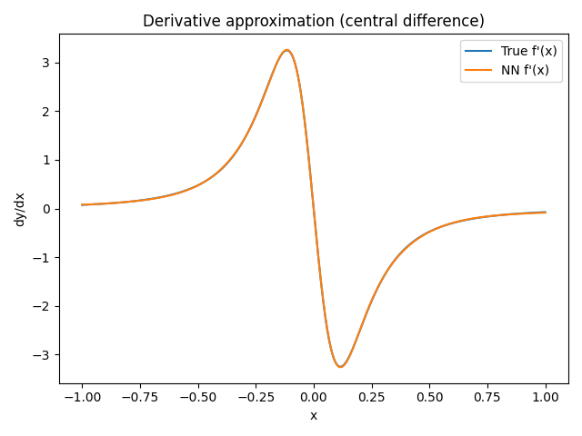

# 使用神經網路近似 Runge 函數及其導數

## Introduction

本次目標是利用 feedforward neural network 去同時近似 Runge
函數與其一階導數：

$$
f(x) = \frac{1}{1+25x^2}, \quad x\in[-1, 1], 
\qquad
f'(x) = \frac{-50x}{(1+25x^2)^2}.
$$

Runge 函數在 $x=0$ 處有明顯峰值，而在區間邊界快速衰減至
0。相較於僅近似函數值，本次作業進一步要求網路也學習對應的導數，並透過兩種誤差指標（函數誤差與導數誤差）來評估模型表現。

## Method

**資料集** 
- 在區間 $[-1,1]$ 上均勻抽樣產生訓練與驗證資料。 
- 每個樣本同時包含 $f(x)$ 與 $f'(x)$ 作為 supervision signal。 
- 額外建立1000 個等距點，用於繪圖與最終誤差評估。

**模型** 
- MLP，包含兩層 hidden layer，activation function 為 
$\tanh$ ，輸出層為 linear。 
- 權重初始化：Xavier
初始化，避免梯度消失或爆炸。

**Loss function** - 本次定義的 loss 為兩部分加權和： 

$$
  L = L_{\text{func}} + \lambda L_{\text{deriv}},
 \text{其中}
L_{\text{func}} = \|y_{\text{pred}} - f(x)\|^2,\
L_{\text{deriv}} = \|y'_{\text{pred}} - f'(x)\|^2。 
$$
- $\lambda$ 為調整兩者重要性的參數，本次先取 $\lambda=1$。

**訓練** 
- Optimizer: SGD with momentum / basic SGD (依上次設定)。
- Regularization: small weight decay。
- Early stopping: 根據 validation loss 停止，並保留最佳模型。

## Results

**函數近似** 
- 網路能成功捕捉 Runge 函數中央峰值與整體形狀。
- 在邊界處仍有誤差，但與理論上的 Runge 現象一致。

**導數近似** 
- 神經網路學到的 $f'(x)$ 與真實導數對比：
- 中央區域（$x \approx 0$）的斜率近似效果良好。
- 在邊界的振盪區域，誤差較大，但仍能捕捉到導數的正負與大致趨勢。

**損失曲線** 
- 訓練與驗證的 function loss、derivative loss 均隨 epoch
收斂：
- $L_{\text{func}}$ 與 $L_{\text{deriv}}$ 皆逐步下降。
- validation 曲線趨於穩定，顯示網路有合理的泛化能力。

**誤差**
- Function MSE on dense grid:
2.495228e-07
- Derivative MSE on dense grid:
4.342517e-05
- Max error（$L_\infty$）顯示導數誤差主要集中在邊界。

## Conclusion

-   加入 derivative loss 能讓模型同時捕捉函數形狀與其變化率。
-   函數近似的效果與前次作業相近，而導數近似則更具挑戰性，尤其在邊界區域。
-   未來若要進一步改善導數的近似精度，可以嘗試：
    1.  增加 hidden units 或層數。
    2.  調整 $\lambda$ 權重，使 derivative loss 在訓練中更為重要。
    3.  嘗試不同 activation functions 或更強大的 optimizers。
