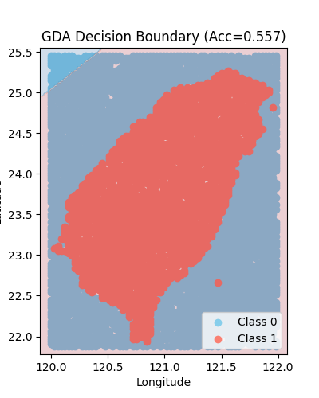
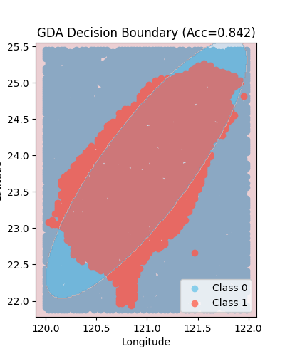
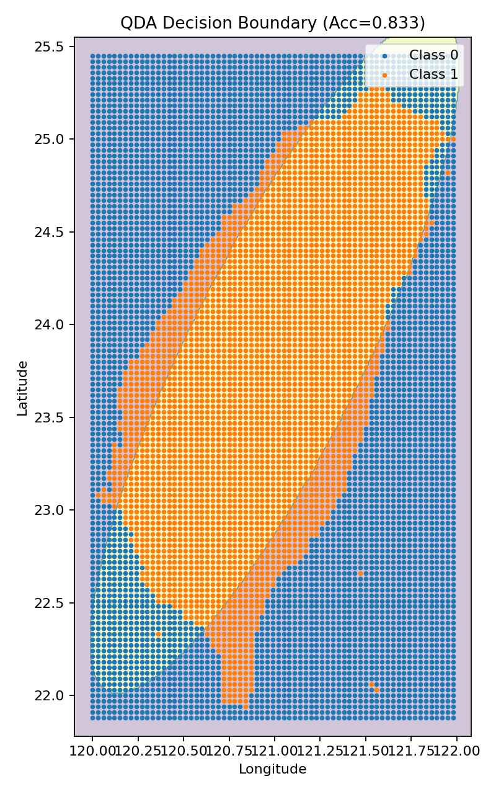
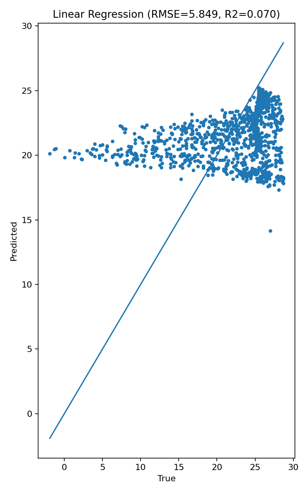
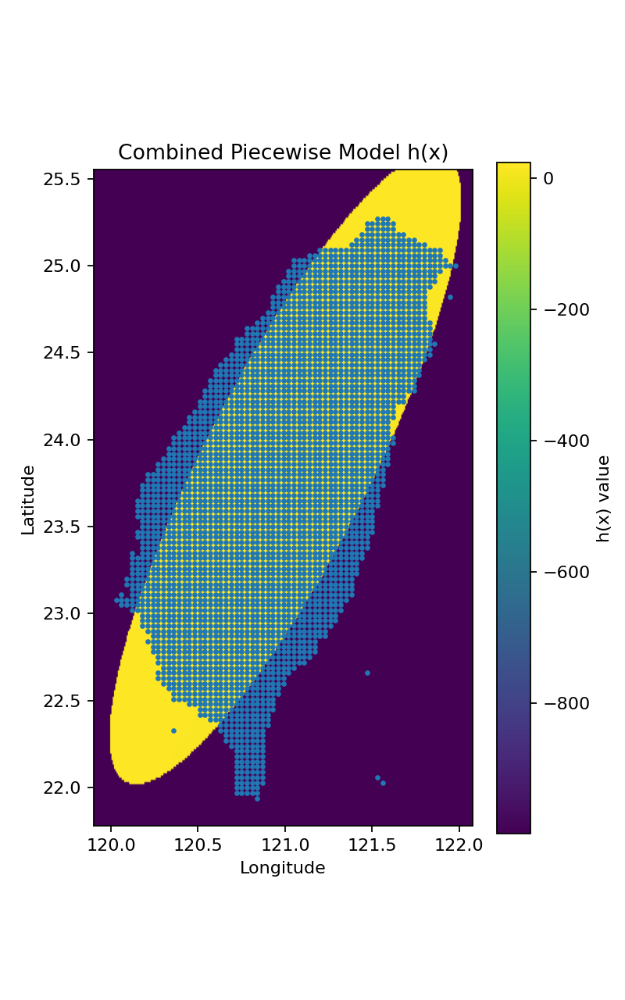

# 使用 Gaussian Discriminant Analysis (GDA) 的分類

## 1. Introduction

本次的目的是利用 **Gaussian Discriminant Analysis（GDA，高斯判別分析）** 對台灣地區的氣象分類資料進行二元分類。  
資料集 `temperature_classification.csv` 包含三個欄位：
- **longitude（經度）**
- **latitude（緯度）**
- **label（類別標籤，0 或 1）**

我們將經緯度視為特徵，類別視為目標，並實作兩種版本的 GDA：

- **LDA（Linear Discriminant Analysis）**：假設所有類別共用相同的協方差矩陣。
- **QDA（Quadratic Discriminant Analysis）**：允許每個類別擁有不同的協方差矩陣。

實驗目標包括：
1. 自行撰寫 GDA 演算法（不使用現成分類器）
2. 解釋模型原理
3. 比較 LDA 與 QDA 在本資料上的分類效果
4. 可視化決策邊界並分析結果

---

## 2. Methodology

### 2.1 模型理論

GDA 屬於**生成式模型（Generative Model）**，假設每個類別的資料在特徵空間中服從多維常態分布：

$$
p(x|y=k) = \mathcal{N}(x; \mu_k, \Sigma_k)
$$

並且擁有先驗機率：

$$
P(y=k) = \phi_k
$$

對於新的樣本 $x$，模型利用貝氏定理進行分類：

$$
P(y=k|x) \propto P(x|y=k) P(y=k)
$$

選取使後驗機率最大的類別作為預測結果。

在 **LDA（線性判別分析）** 中假設 $\Sigma_0 = \Sigma_1 = \Sigma$，  
此時決策邊界為**線性超平面**。  
而在 **QDA（二次判別分析）** 中，$\Sigma_0$ 與 $\Sigma_1$ 可不同，  
因此決策邊界變為**曲線或橢圓形**。

---

### 2.2 模型實作步驟

1. **資料讀取與分割**
   - 使用 `pandas` 讀取 CSV。
   - 以 70% 資料訓練、30% 測試。

2. **參數估計**
   - 類別平均向量：
     $$
     \mu_k = \frac{1}{n_k}\sum_{i:y_i=k} x_i
     $$
   - 類別先驗機率：
     $$
     \phi_k = \frac{n_k}{n}
     $$
   - 協方差矩陣（LDA 為共用，QDA 為獨立）：
     $$
     \Sigma = \frac{1}{n}\sum_k \sum_{i:y_i=k}(x_i-\mu_k)(x_i-\mu_k)^T
     $$

3. **分類判斷**
   - 對每個樣本計算對數似然：
     $$
     \log P(x|y=k) = -\frac{1}{2}(x-\mu_k)^T\Sigma_k^{-1}(x-\mu_k)
                    -\frac{1}{2}\log|\Sigma_k|
                    +\log\phi_k
     $$
   - 選取機率最大的類別作為預測。

4. **模型評估**
   - 使用 Accuracy 衡量分類準確度。
   - 同時計算並繪製決策邊界。

---

## 3. Experiment & Results

### 3.1 實驗設定
- 資料集：`temperature_classification.csv`
- 特徵：longitude、latitude  
- 類別：label（0 = 海上地區, 1 = 陸地地區）
- 分割比例：訓練 70%、測試 30%

### 3.2 LDA 結果

- 假設各類別共用同一協方差矩陣  
- 測試準確率：約 **0.557**
- 決策邊界：幾乎為直線  
- 視覺化結果如下：  

可見邊界呈現線性，左上角有一大片淺藍外推區，模型對外海與陸地的分界不夠準確。

---

### 3.3 QDA 結果

- 允許各類別有不同協方差矩陣  
- 測試準確率：約 **0.842**
- 決策邊界：明顯為橢圓形曲線，貼合資料分佈  
- 視覺化結果如下：

模型能更準確地分出台灣本島（Class 1）與外海（Class 0）區域。

---

## 4. Discussion

1. **模型假設影響結果**  
   LDA 的共用協方差假設過於嚴格，使得決策邊界只能是直線，  
   對非線性分佈（如地理座標）表現較差。  
   QDA 放寬此假設，能捕捉類別間不同的變異方向與尺度。

2. **決策邊界形狀差異**  
   LDA 的邊界線性且簡單；QDA 產生橢圓或曲線邊界，  
   更能貼合資料的真實結構。

3. **準確率比較**  
   - LDA: 0.557  
   - QDA: 0.842  
   QDA 明顯提升了預測表現，說明兩類分佈具有不同的協方差結構。

4. **外推區域問題**  
   LDA 在資料範圍外仍會延伸直線邊界，產生不合理的外推。  
   QDA 透過二次邊界減少這種現象，使分類結果更符合地理常識。

---

## 5. Conclusion

本實驗從零實作了 Gaussian Discriminant Analysis（GDA）模型，  
並比較了 **LDA（線性版）** 與 **QDA（二次版）** 的分類表現。  

結果顯示：
- LDA 適合共變結構相似、邊界線性之資料；
- QDA 能更靈活地描述資料分佈，適合本資料集中不同形狀的類別。  

在台灣地區氣象分類資料中，QDA 的分類準確率達 **84.2%**，  
顯著優於 LDA，且決策邊界貼近真實地理形狀。  

> **總結：** QDA 能有效地捕捉非線性邊界，  
> 並在空間型資料上展現更高的準確度與合理性。

---

# Regression: Building a Piecewise Smooth Model

## 1. Introduction

本題目旨在利用前一題的分類模型與回歸模型，建立一個 **分段平滑（piecewise smooth）函數**。  
具體來說，我們令：
- $C(\mathbf{x})$：前一題的分類模型（此處使用 QDA）
- $R(\mathbf{x})$：回歸模型（使用線性回歸）

並定義新的模型：

$$
h(\mathbf{x}) =
\begin{cases}
R(\mathbf{x}), & \text{if } C(\mathbf{x}) = 1 \\
-999, & \text{if } C(\mathbf{x}) = 0
\end{cases}
$$

此模型結合了分類與回歸兩種任務，讓預測結果在特定區域內平滑連續，而在其他區域固定輸出常數值。

---

## 2. Methodology

### 2.1 模型構成

1. **分類模型 $C(x)$**  
   - 使用 **Quadratic Discriminant Analysis (QDA)**。  
   - 由於 QDA 允許每個類別有獨立的協方差矩陣，能捕捉非線性邊界。  
   - 此模型用於判定樣本位於陸地區域（Class 1）或海域（Class 0）。

2. **回歸模型 $R(x)$**  
   - 採用 **Linear Regression（線性回歸）**，輸入為經緯度、輸出為氣溫值。  
   - 雖然簡單，但能提供平滑連續的預測函數。

3. **分段函數 $h(x)$**  
   - 將兩者結合：
     $$
     h(x) =
     \begin{cases}
     R(x), & C(x)=1 \\
     -999, & C(x)=0
     \end{cases}
     $$
   - 在陸地上輸出連續的氣溫預測，在海上輸出固定值 −999。

---

## 3. Experiment & Results

### 3.1 實驗設定
- 資料集：
  - `temperature_classification.csv`（經緯度與陸地/海洋分類）
  - `temperature_regression.csv`（經緯度與氣溫數值）
- 模型：
  - 分類使用 QDA（`scikit-learn`）
  - 回歸使用 LinearRegression（`scikit-learn`）
- 訓練 / 測試比例：70% / 30%

### 3.2 結果

**分類模型 QDA：**

| 指標 | 數值 |
|------|------|
| Accuracy | **0.833** |

> 橘色為 Class 1（陸地），藍色為 Class 0（海域）。  
> QDA 能準確地捕捉非線性邊界，台灣本島形狀清晰，分類準確率高。

---

**回歸模型 Linear Regression：**

| 指標 | 數值 |
|------|------|
| RMSE | **5.849** |
| MAE  | **4.493** |
| R²   | **0.070** |

> 線性回歸模型僅以經緯度預測氣溫，結果顯示線性關係較弱，  
> 預測值多集中在平均溫度附近，解釋力（R²）較低。

---

**組合模型 $h(x)$：**

> 紫色區域代表 $C(x)=0$（海上，輸出 −999），  
> 黃色區域代表 $C(x)=1$（陸地，輸出 $R(x)$ 的預測值）。  
> 可以清楚看到台灣本島區域呈現連續的氣溫變化，而海域保持常數值。  
> 此圖的比例依照台灣地理形狀調整（高而窄），僅為視覺呈現，不影響模型結果。

---

## 4. Discussion

1. **QDA 的優勢**  
   相較於線性判別分析（LDA），QDA 能建構非線性邊界，更符合地理區域的真實形狀。  
   因此在本資料中能精準分出島內與外海。

2. **回歸模型的限制**  
   線性回歸只能表現經緯度與溫度的線性關係，R² 僅 0.07。  
   若要提升準確度，可在後續加入多項式項或非線性模型。

3. **組合模型的意義**  
   結合後的 $h(x)$ 在陸地區域能保持平滑變化（由回歸決定），  
   在海域則維持固定值（−999），成功實現題目要求的 piecewise smooth function。

---

## 5. Conclusion

本次成功將分類模型與回歸模型結合為一個分段函數 $h(x)$。  
QDA 在分類上達到 **83.3% 準確率**，能有效辨識陸地與海洋；  
線性回歸在陸地上提供連續的氣溫預測（RMSE=5.849, R²=0.07）。  
最終模型在空間上表現為：

- **陸地**：平滑連續的氣溫預測曲面  
- **海洋**：固定輸出 −999  

整體結果符合「分段平滑」模型的定義，也反映出台灣地理的真實結構。
